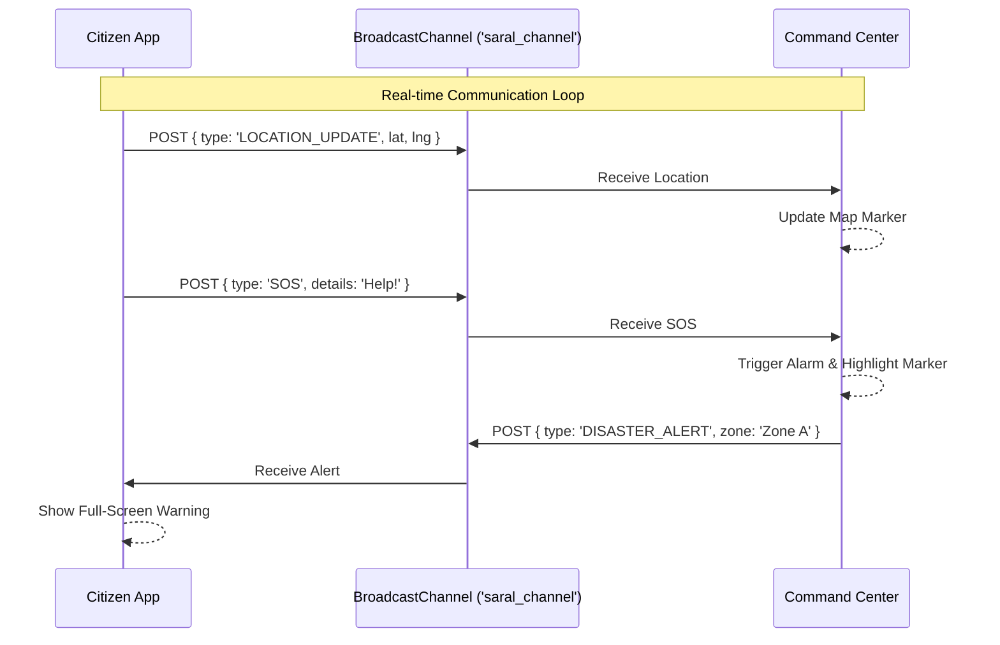

# System Architecture - SARAL (Smart Alert & Resilient Aid Layer)

## 🏗️ Overview

SARAL (Smart Alert & Resilient Aid Layer) is designed as a distributed system to manage disaster response and crowd control. The current implementation serves as a **high-fidelity prototype** that demonstrates the core logic, user flows, and real-time interaction capabilities using browser-native APIs to simulate a full-stack environment.

## 🧩 System Components

The architecture consists of two primary client-side applications that communicate via a shared message bus.

### 1. Command Center (Admin Client)
*   **Role:** Centralized dashboard for authorities.
*   **Responsibilities:**
    *   **Data Aggregation:** Collects signals from all user instances.
    *   **Visualization:** Renders geospatial data on Leaflet maps.
    *   **Decision Support:** Provides resource status and environmental feeds.
    *   **Broadcasting:** Issues system-wide alerts to user clients.
*   **Key Modules:**
    *   `MapController`: Manages Leaflet markers, layers, and heatmaps.
    *   `IncidentLogger`: Parses incoming messages and updates the incident table.
    *   `ResourceLogistics`: Tracks inventory (Water, Meds) vs. Demand.

### 2. Citizen App (User Client)
*   **Role:** Mobile interface for the general public.
*   **Responsibilities:**
    *   **Telemetry:** Sends location updates and status heartbeats.
    *   **Reporting:** Interface for SOS, Medical, and Damage reports.
    *   **Navigation:** Calculates routes to safe zones using OSRM.
    *   **Alerting:** Receives and displays emergency broadcasts.
*   **Key Modules:**
    *   `LocationManager`: Handles Geolocation API and heartbeat simulation.
    *   `MeshSimulator`: Toggles between "Online" and simulated "Mesh" modes.
    *   `TriageSystem`: Standardized form for medical reporting.

---

## 🔄 Data Flow Architecture

In this prototype, the **BroadcastChannel API** acts as the pseudo-backend, enabling bi-directional communication between the Admin and User tabs without a server.



### Message Protocol
All communication follows a standardized JSON structure:
```json
{
  "userId": "CITIZEN-1234",
  "type": "SOS | LOCATION_UPDATE | DISASTER_ALERT | ...",
  "payload": {
    "location": "28.61, 77.20",
    "details": "...",
    "timestamp": "12:00:00"
  }
}
```

---

## 🗺️ Routing & Stampede Prevention Logic

One of the core architectural innovations is the client-side load balancing for crowd control.

1.  **User ID Hashing:** Each user is assigned a unique ID (e.g., `CITIZEN-4521`).
2.  **Zone Assignment:** The system parses the ID to deterministically assign a "Safe Zone".
    *   *Even IDs* -> **Safe Zone A**
    *   *Odd IDs* -> **Safe Zone B**
3.  **Route Calculation:** The app queries the OSRM API for a route specifically to the *assigned* zone, effectively splitting the crowd and preventing bottlenecks at a single exit point.

---

## 🛠️ Technical Decisions & Trade-offs

| Decision | Rationale | Trade-off |
| :--- | :--- | :--- |
| **BroadcastChannel** | Zero-setup real-time simulation for demos. | Works only within the same browser instance. |
| **Tailwind CSS** | Rapid UI development and consistent styling. | Requires CDN dependency (online) or build step. |
| **Leaflet.js** | Lightweight, open-source, mobile-friendly. | Less advanced 3D features compared to Mapbox/Google. |
| **Client-Side Logic** | Immediate feedback, no server latency. | Security risk (logic exposed), no persistence. |

---

## 🚀 Scalability Path (Production)

To move from Prototype to Production, the architecture would evolve as follows:

1.  **Communication Layer:** Replace `BroadcastChannel` with **WebSockets (Socket.io)** backed by Redis Pub/Sub for handling millions of concurrent connections.
2.  **Backend:** Implement a **Node.js/Go** server to handle authentication, data validation, and persistence.
3.  **Database:** Use **PostgreSQL (PostGIS)** for geospatial data storage and querying.
4.  **Offline Capability:** Implement **Service Workers** (PWA) and integrate with **LoRaWAN** hardware bridges for true offline mesh networking.
```
