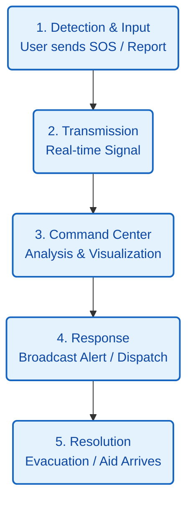

# SARAL System - Core Workflow

A high-level, linear overview of the disaster management lifecycle in 5 key stages.

```mermaid
graph TD
    %% Styles
    classDef stage fill:#e3f2fd,stroke:#1565c0,stroke-width:2px,color:#0d47a1,rx:5,ry:5;
    classDef arrow stroke:#546e7a,stroke-width:2px;

    %% Nodes
    Stage1(1. Detection & Input<br/>User sends SOS / Report):::stage
    Stage2(2. Transmission<br/>Real-time Signal):::stage
    Stage3(3. Command Center<br/>Analysis & Visualization):::stage
    Stage4(4. Response<br/>Broadcast Alert / Dispatch):::stage
    Stage5(5. Resolution<br/>Evacuation / Aid Arrives):::stage

    %% Connections
    Stage1 --> Stage2
    Stage2 --> Stage3
    Stage3 --> Stage4
    Stage4 --> Stage5
```
