# Project Flowchart - SARAL System

This flowchart illustrates the complete interaction flow between the **Citizen App** and the **Command Center**, detailing every button action, message transmission, and resulting UI update.

```mermaid
graph TD
    %% --- STYLING DEFINITIONS ---
    classDef userNode fill:#e0f2f1,stroke:#00695c,stroke-width:2px,color:#004d40,rx:10,ry:10;
    classDef adminNode fill:#f3e5f5,stroke:#7b1fa2,stroke-width:2px,color:#4a148c,rx:10,ry:10;
    classDef alertNode fill:#ffebee,stroke:#c62828,stroke-width:2px,color:#b71c1c,rx:5,ry:5;
    classDef msgNode fill:#fff3e0,stroke:#ef6c00,stroke-width:2px,stroke-dasharray: 5 5,color:#e65100,shape:hexagon;
    classDef actionNode fill:#f1f8e9,stroke:#33691e,stroke-width:1px,color:#1b5e20,rx:5,ry:5;
    classDef processNode fill:#e3f2fd,stroke:#1565c0,stroke-width:1px,color:#0d47a1,shape:rect;

    %% --- CITIZEN APP SECTION ---
    subgraph UserApp ["📱 Citizen App (User_Interface.html)"]
        direction TB
        User([👤 User / Citizen]):::userNode
        
        subgraph UserActions [User Actions]
            direction TB
            BtnSOS[🔴 SOS EMERGENCY]:::alertNode
            BtnHealth[🏥 Report Health]:::userNode
            BtnDamage[🏚️ Report Damage]:::userNode
            BtnMissing[🔍 Find People]:::userNode
            BtnVol[🤝 Volunteer]:::userNode
            BtnNav[🧭 Navigate Safe Zone]:::actionNode
        end
        
        User --> BtnSOS
        User --> BtnHealth
        User --> BtnDamage
        User --> BtnMissing
        User --> BtnVol
        User --> BtnNav
        
        RouteCalc[[⚙️ Calculate Route OSRM]]:::processNode
        BtnNav --> RouteCalc
        RouteCalc --> MapDisplay[🗺️ Display Safe Route]:::processNode
        
        MeshToggle[📡 Toggle Mesh Mode]:::actionNode
        User --> MeshToggle
    end

    %% --- COMMUNICATION CHANNEL ---
    subgraph CommLayer ["📡 Communication Layer (BroadcastChannel)"]
        direction TB
        MsgSOS{{⚡ SOS Signal}}:::msgNode
        MsgMed{{� Medical Report}}:::msgNode
        MsgDmg{{⚠️ Damage Report}}:::msgNode
        MsgMiss{{� Missing Person}}:::msgNode
        MsgVol{{🙋 Help/Volunteer}}:::msgNode
        MsgLoc{{� Location Heartbeat}}:::msgNode
        
        MsgAlert{{� DISASTER ALERT}}:::alertNode
        MsgClear{{✅ ALL CLEAR}}:::actionNode
    end

    %% --- COMMAND CENTER SECTION ---
    subgraph AdminDash ["🏢 Command Center (index.html)"]
        direction TB
        Admin([👮 Admin Authority]):::adminNode
        
        subgraph AdminView [Dashboard Visualization]
            MapAdmin[🗺️ Live Map & Tracking]:::adminNode
            TableInc[📝 Incident Log Table]:::adminNode
            FeedLive[rss Live Situation Feed]:::adminNode
            ResLog[� Resource Logistics]:::adminNode
            Alarm[� Audio Alarm System]:::alertNode
        end
        
        subgraph AdminControls [Admin Controls]
            BtnBroadcast[📢 Broadcast Alert]:::alertNode
            BtnClearAlert[✅ Clear Alert]:::actionNode
            BtnDispatch[🚚 Dispatch Resources]:::actionNode
        end

        Admin --> BtnBroadcast
        Admin --> BtnClearAlert
        Admin --> BtnDispatch
        
        BtnDispatch --> ResLog
    end

    %% --- DATA FLOW CONNECTIONS ---
    
    %% User -> Channel
    BtnSOS ==> MsgSOS
    BtnHealth --> MsgMed
    BtnDamage --> MsgDmg
    BtnMissing --> MsgMiss
    BtnVol --> MsgVol
    User -.->|Auto 5s| MsgLoc

    %% Channel -> Admin
    MsgSOS ==>|Trigger| Alarm
    MsgSOS ==>|Update| MapAdmin & TableInc
    MsgMed -->|Update Triage| TableInc
    MsgDmg --> MapAdmin & TableInc
    MsgMiss --> FeedLive
    MsgVol --> ResLog
    MsgLoc --> MapAdmin

    %% Admin -> Channel
    BtnBroadcast ==> MsgAlert
    BtnClearAlert --> MsgClear

    %% Channel -> User
    MsgAlert ==>|Show Full Screen Overlay| UserApp
    MsgClear -->|Remove Overlay| UserApp

    %% Link Styling
    linkStyle default stroke:#546e7a,stroke-width:1px;
```

## 📝 Legend
*   **Blue Nodes:** Citizen App Actions
*   **Purple Nodes:** Command Center Updates
*   **Yellow Nodes:** User Interactions (Buttons/Forms)
*   **Red Nodes:** Critical Alerts & Emergency Actions
*   **Grey/Dashed Nodes:** System/Background Processes
